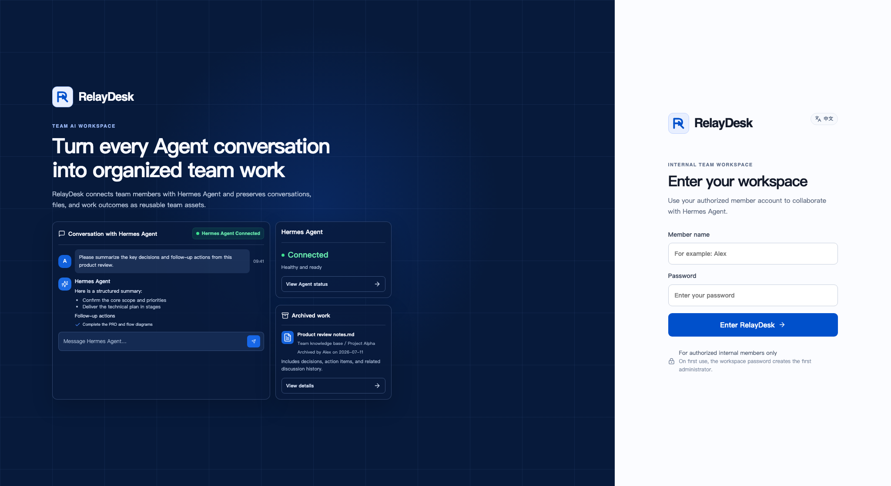
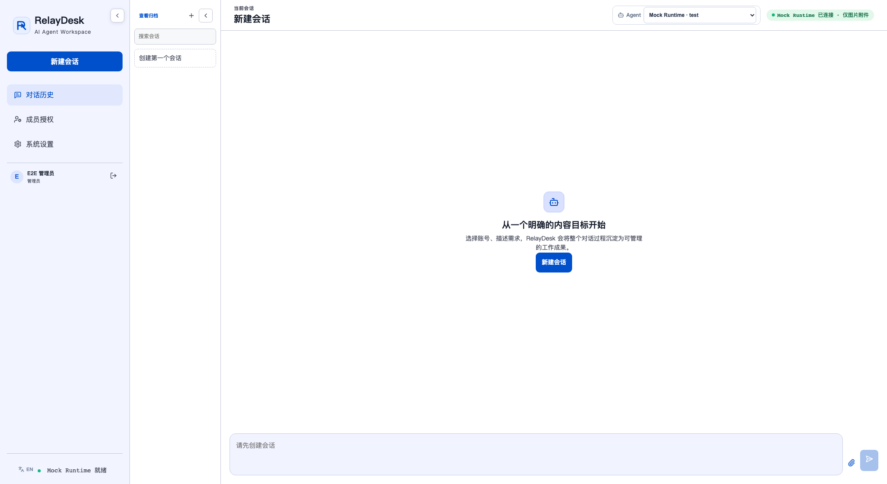

# RelayDesk

> **RelayDesk — An Open-Source Web UI for Hermes Agent**

[English](README.md) | [简体中文](README.zh-CN.md)

RelayDesk is a self-hosted web channel for **Hermes Agent**. It keeps private
conversations, assets and backups on the local server while
Hermes remains responsible for LLMs, tools, memory and image generation.

RelayDesk is an independent community project and is not affiliated with or endorsed by Nous Research.

Licensed under the [Apache License 2.0](LICENSE).

## Highlights

- Real Hermes API Server integration with streaming responses and tool events.
- Private conversations per member, with Agent access grants and session isolation.
- Safe file uploads and local asset archiving under a controlled directory.
- Multi-host Hermes Profile discovery, health checks, credential encryption and backups.
- English and Simplified Chinese UI with a one-click language switcher.

## Screenshots

Screenshots are generated with the mock Runtime and contain no production data.

| Login | Chat workspace |
| --- | --- |
|  |  |

## Start Locally

1. Copy `.env.example` to `.env`.
2. Set a strong `RELAYDESK_PASSWORD` and `RELAYDESK_SESSION_SECRET`.
3. Run `pnpm install` and `pnpm dev`.
4. Open `http://localhost:3000` and sign in with the shared workspace password.

`RELAYDESK_RUNTIME_TYPE=mock` is only for development and automated tests. For production Hermes usage, enable its official API Server
(`API_SERVER_ENABLED=1`) and set `RELAYDESK_RUNTIME_TYPE=hermes`,
`RELAYDESK_HERMES_BASE_URL`, and `RELAYDESK_HERMES_API_KEY`. See
[Hermes integration](docs/hermes-integration.md).

## Verify

Run `pnpm lint`, `pnpm typecheck`, `pnpm test`, and `pnpm build` before deployment. `GET /api/health` reports application, SQLite, controlled storage and Runtime health.

## Docker

Set the required values in `.env`, then run `docker compose up --build`. Persistent data is mounted at `/app/data` in the `relaydesk-data` volume. When Hermes runs on the host, use `host.docker.internal` rather than `127.0.0.1`; native deployment is recommended when Hermes must read uploaded local documents.

## Boundaries

- RelayDesk never calls model-provider APIs directly.
- Runtime traffic always goes through `RuntimeConnector`.
- SQLite stores metadata and complete messages; files are archived under the controlled data directory.
- Hermes is the only production Runtime Connector in this release. The
  connector contract is intentionally runtime-neutral, but OpenClaw support is
  planned rather than currently shipped.

## Languages

RelayDesk detects the browser language and supports English and Simplified
Chinese (`en`, `zh-CN`). Users can switch the workspace language from the
sidebar. Runtime output is displayed exactly as returned by Hermes.

See [architecture.md](docs/architecture.md), [deployment.md](docs/deployment.md), [hermes-integration.md](docs/hermes-integration.md), [Agent fleet management](docs/agent-fleet-management.md), [backup-restore.md](docs/backup-restore.md), and the [roadmap](docs/roadmap.md) for details.
