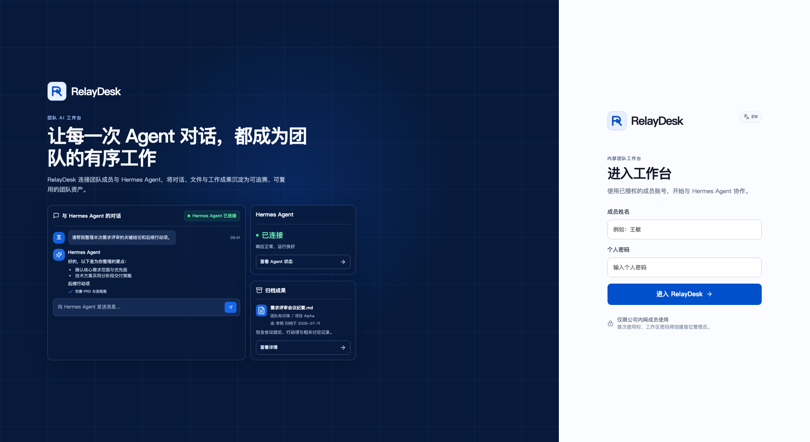

# RelayDesk

> **RelayDesk - Hermes Agent 的开源 Web UI**

[English](README.md) | [简体中文](README.zh-CN.md)

RelayDesk 是面向 **Hermes Agent** 的自托管 Web 通道。它将私聊记录、文件
产物与备份保存到受控的本地目录；LLM、工具、Memory 和 Agent Loop 仍完全由
Hermes 负责。

RelayDesk 是独立的社区项目，与 Nous Research 没有隶属或官方背书关系。

采用 [MIT License](LICENSE) 开源。

## 核心能力

- 通过 Hermes API Server 进行真实连接，支持流式回复与工具事件。
- 按成员隔离私聊会话，并通过 Agent 授权控制访问范围。
- 文件安全上传，并将 Agent 产物归档到服务器受控目录。
- 支持多主机 Hermes Profile 发现、健康检查、凭据加密与数据备份。
- 中英文界面，一键切换语言。

## 界面预览

展示图使用 Mock Runtime 自动生成，不包含生产数据。

| 登录页 | 对话工作台 |
| --- | --- |
|  |  |

## 本地启动

1. 将 `.env.example` 复制为 `.env`。
2. 设置强密码 `RELAYDESK_PASSWORD` 与 `RELAYDESK_SESSION_SECRET`。
3. 运行 `pnpm install && pnpm dev`。
4. 打开 `http://localhost:3000`，使用已授权成员账号登录。

`RELAYDESK_RUNTIME_TYPE=mock` 仅用于开发与自动化测试。生产环境请启用
Hermes 官方 API Server（`API_SERVER_ENABLED=1`），并配置
`RELAYDESK_RUNTIME_TYPE=hermes`、`RELAYDESK_HERMES_BASE_URL`、
`RELAYDESK_HERMES_API_KEY`。详见 [Hermes 集成说明](docs/hermes-integration.md)。

## 部署与安全

- 使用 `docker compose up --build` 可启动持久化部署。
- `data/`、`.env`、SQLite 与上传文件均被 Git 忽略，不会进入公开仓库。
- 所有 Runtime 流量经过 `RuntimeConnector`；RelayDesk 不直接调用模型供应商。
- 运行 `pnpm verify:release` 可执行发布前质量检查。

更多资料：[架构](docs/architecture.md)、[部署](docs/deployment.md)、
[备份与恢复](docs/backup-restore.md)、[路线图](docs/roadmap.md)。
